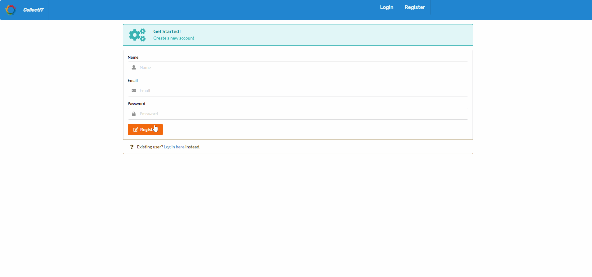

## CollectIT

CollectIT is a full stack IT Asset Management application currently in it's final stages of development. This application will be open sourced once complete.

## Featues
- Complete Asset management system for companies
- Toggle between admin or user role from the settings panel
- Admins can create, update and delete assets
- Users can create and update assets
- Quickly search assets using an asset's AssetID
- Monitor asset health
- User authentication

## Technologies used:

- SemanticUI
- React with Hooks for state management
- Node
- Express
- MongoDB
- JWT for user authentication

## App Demo

## App installation:
- Download the repo as a zip file or clone the repo
- From your terminal in the collectIT folder, cd server and then npm install
- Then in the terminal type 'node server.js'
- cd client and then npm install
- Then in the terminal type 'npm run start'

## Ongoing development:

- A good amount of work needs to be done on the stylingas the main focus was on app functionality at the start
- User edit profile page needs to be created
